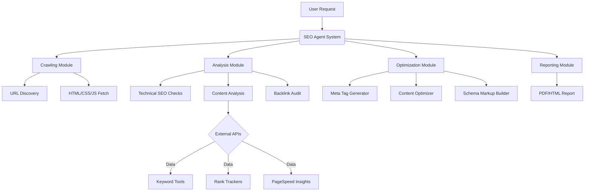

# SEO-Agent

Below is a comprehensive implementation guideline to build an SEO Agent, including a **system diagram**, **step-by-step workflow**, and **technical components**. This structure follows the "tour" metaphor (sequential steps) for clarity.

---

### **System Diagram**


---

### **Implementation Ingredients**
1. **Core Components**:
   - **Crawler/Spider**: Python (`Scrapy`, `BeautifulSoup`, `Selenium` for JS sites)
   - **SEO Analysis Engine**: 
     - Technical checks (sitemaps, redirects, headers)
     - Content analyzer (NLTK/spaCy for NLP, keyword density)
     - Backlink checker (Ahrefs/SEMrush API)
   - **Optimization Tools**:
     - Meta tag generator
     - Schema.org JSON-LD builder
     - Internal linking suggester
   - **Reporting**: PDF/HTML templates (`Jinja2`, `ReportLab`)

2. **APIs & External Services**:
   - Google PageSpeed Insights API
   - Moz/Ahrefs for backlinks
   - Google Analytics Data API
   - OpenAI API (for content suggestions)

3. **Data Storage**:
   - SQLite (lightweight) or PostgreSQL (scalable)
   - JSON/CSV for crawl results
   - Elasticsearch (for fast content queries)

4. **Infrastructure**:
   - Python 3.10+ (main language)
   - Docker (containerization)
   - FastAPI/Flask (REST endpoints)
   - Celery (background tasks)

---

### **Step-by-Step Tour (Workflow)**
#### **Step 1: Crawling & Discovery**
- **Actions**:
  1. Start from seed URL.
  2. Crawl all internal links (respect `robots.txt`).
  3. Extract HTML, headers, scripts, and sitemaps.
- **Tools**: `Scrapy` (with rate limiting), `SitemapParser`.
- **Output**: URL inventory + page resources.

#### **Step 2: Technical SEO Audit**
- **Actions**:
  1. Check HTTP status codes (404s, redirect chains).
  2. Validate mobile responsiveness.
  3. Analyze Core Web Vitals (LCP, FID, CLS).
  4. Inspect `robots.txt`, `.htaccess`, and structured data.
- **Tools**: Lighthouse CI, PageSpeed API, `lxml` for XML parsing.
- **Output**: Technical issue report (e.g., slow pages, broken links).

#### **Step 3: Content & Keyword Analysis**
- **Actions**:
  1. Extract keywords from titles/H1s (TF-IDF analysis).
  2. Check duplicate content (hashing/text similarity).
  3. Grade readability (Flesch-Kincaid score).
  4. Compare against competitor keywords.
- **Tools**: `spaCy` (NLP), `pandas` for data, SEMrush API.
- **Output**: Keyword gap analysis + content optimization suggestions.

#### **Step 4: Off-Page & Backlink Audit**
- **Actions**:
  1. Fetch backlink profile (domain authority, spam score).
  2. Identify toxic links.
  3. Track keyword rankings.
- **Tools**: Ahrefs API, Moz Link Explorer.
- **Output**: Backlink report + disavow recommendations.

#### **Step 5: Optimization & Recommendations**
- **Actions**:
  1. Generate meta tags (title/description length checks).
  2. Propose internal links.
  3. Build JSON-LD schema snippets.
  4. Suggest image compression.
- **Tools**: Custom rule engine, `Pillow` for images.
- **Output**: Optimization checklist (e.g., "Add schema to /products").

#### **Step 6: Reporting & Alerts**
- **Actions**:
  1. Compile PDF/HTML report with scores.
  2. Send email alerts for critical issues.
  3. Export data to Google Sheets/CSV.
- **Tools**: `Jinja2` templates, `smtplib`, Apache Airflow (scheduling).
- **Output**: Executive summary + actionable insights.

---

### **Sample Code Snippet (Technical Audit)**
```python
from seo_agent import SEOCrawler, SEOTechnicalAudit

# Initialize crawler
crawler = SEOCrawler(
    start_url="https://example.com",
    user_agent="SEO-Agent/1.0",
    max_depth=3
)
crawler.run()  # Outputs sitemap.json

# Run technical audit
auditor = SEOTechnicalAudit(sitemap="sitemap.json")
results = auditor.check(
    metrics=["redirects", "mobile_friendly", "hreflang"],
    use_pagespeed=True
)

# Generate report
auditor.export_report(format="pdf", filename="seo_audit.pdf")
```

---

### **Key Requirements**
1. **Accuracy**: Use real-time data from Google Search Console.
2. **Scalability**: Queue systems (Redis + Celery) for large sites.
3. **Ethical Compliance**: Adhere to `robots.txt`, rate limits.
4. **Extensibility**: Plugin architecture for new SEO rules.

### **Deployment**
- Run locally: `python main.py --url https://your-site.com`
- Cloud: Docker on AWS ECS/Azure Container Instances.
- Schedule daily audits: Cron jobs or Airflow DAGs.

This structure ensures your SEO agent is **actionable**, **scalable**, and covers all SEO dimensions. Adjust modules based on budget (e.g., use open-source tools if API costs are prohibitive).
